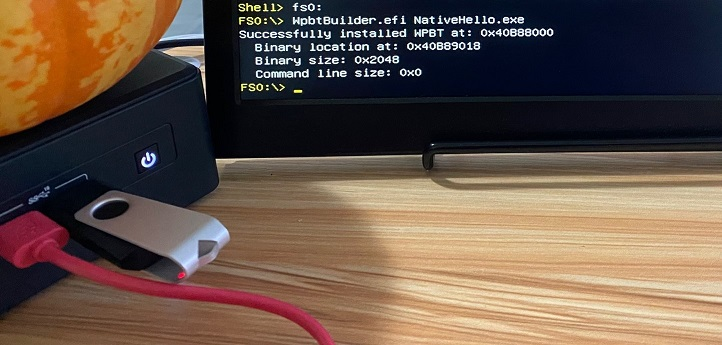
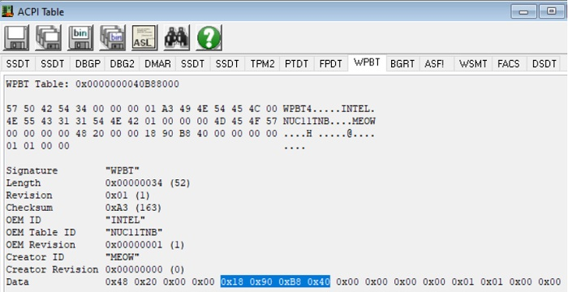
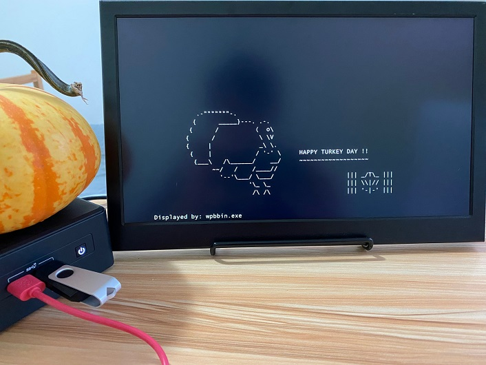
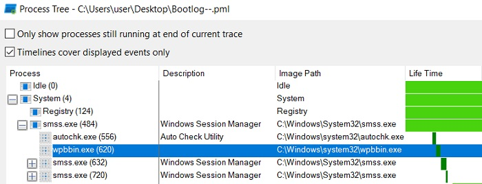

WPBT Builder
=============

This is a simple UEFI application to create a Windows Platform Binary Table (WPBT) from the UEFI shell.





Motivation
-----------

WPBT is one of the Advanced Configuration and Power Interface (ACPI) tables that allows pre-boot software to register a native NT application for its auto-execution when Windows starts up[[1](https://download.microsoft.com/download/8/A/2/8A2FB72D-9B96-4E2D-A559-4A27CF905A80/windows-platform-binary-table.docx)].

Since WPBT provides a persistent mechanism for the Windows platform, it gained attention multiple times from a security community in the past. As the latest example, Eclypsium discovered that Windows executes the platform binary that was signed by a revoked certificate, allowing the use of the feature without having to own a legitimate certificate[[2](https://eclypsium.com/2021/09/23/everyone-gets-a-rootkit/)].

Although WPBT has been a known concern for security-minded people for years, it remains to be obscure technology and a challenge for many of those who wish to assess the impacts and risks of potential (ab)use of WPBT. This is due to their unfamiliarity with UEFI programming, which is required to create or modify WPBT.

Given that, this program aims to help those security researchers examine the behaviour of WPBT by offering an easy interface to build it with an arbitrary platform binary file.


Usage
------

Platform Requirements
- Tested on Windows 10 and 11 on UEFI
- Physical machine (due to a lack of required UEFI protocol implementation)
- Secure boot must be disabled to enter the UEFI shell

To run the WPBT Builder, follow the steps below:

1. Preparing a USB thumb drive
    1. Format the USB thumb drive for FAT32
    2. Copy files and directories under `USB` to the USB drive
2. Boot the target system from the USB drive
    1. This is device-specific. Typically, hitting F2 or F12 while the OEM logo is displayed will bring to either the BIOS setup or boot menu, which lets us boot the system from the USB drive. Consult the OEM's documentation.
3. Running the WPBT builder
    1. Select the file-system that corresponds to the USB drive. This is typically `fs0:`
        ```
        Shell> fs0:
        fs0> ls
        ...
        10/09/2021  13:25         35,648  WpbtBuilder.efi
        ...
        ```
    2. Run the WpbtBuilder.efi with a path to the native NT application to be executed through WPBT, for example,
        ```
        fs0> WpbtBuilder.efi NativeHello.exe
        Successfully installed WPBT at: 0x40B98000
          Binary location at: 0x40B8A018
          Binary size: 0x1600
          Command line size: 0x0
        ```
4. Continue booting Windows
    1. Typically, exiting from the UEFI shell and selecting `Windows Boot Manager` from the boot menu is sufficient.
        ```
        fs0> exit
        ```


Confirming Execution
---------------------

A cute turkey ASCII art is displayed if the accompanying native NT application (NativeHello.exe) is specified and successfully executed.



Alternatively, one can use the "Boot Logging" feature with Process Monitor to confirm the wpbbin.exe is started from smss.exe.




Debugging smss.exe
-------------------

To debug smss.exe code that consumes WPBT, enable the kernel debugging and use the following Windbg commands on the first break-in.
```
> ad /q ImageFileName; bp nt!PspInsertProcess "aS /ma ${/v:ImageFileName} @@c++(((nt!_EPROCESS *) @rcx)->ImageFileName); .block { .if ($spat(\"${ImageFileName}\", \"smss*\")) { } .else { gc }}"; g

> .process /r /p @rcx; eb @$peb+2 1; g

> .reload /user; bu smss!NtProcessStartupW; g
```
In the end, the debugger will break into the target at the entry point of smss.exe. This lets you debug code as you need.


Building and Signing NativeHello
---------------------------------

Use Visual Studio 2019 to build it. Then, place the compiled binary into `WPBT-Builder\NativeHello\Signing` and run `SignNativeHello.bat` with the administrator privileges.

```
>cd NativeHello\Signing
>copy /y ..\x64\Release\NativeHello.exe .
        1 file(s) copied.
>SignNativeHello.bat
Changing the system clock for signing.
The following certificate was selected:
    Issued to: HT Srl
    Issued by: VeriSign Class 3 Code Signing 2010 CA
    Expires:   Sat Aug 08 16:59:59 2015
    SHA1 hash: 598B7172B3790CCCB7CB07388E0D0A644D614D9C

Cross certificate chain (using machine store):
    Issued to: Microsoft Code Verification Root
    Issued by: Microsoft Code Verification Root
    Expires:   Sat Nov 01 06:54:03 2025
    SHA1 hash: 8FBE4D070EF8AB1BCCAF2A9D5CCAE7282A2C66B3

        Issued to: VeriSign Class 3 Public Primary Certification Authority - G5
        Issued by: Microsoft Code Verification Root
        Expires:   Mon Feb 22 12:35:17 2021
        SHA1 hash: 57534CCC33914C41F70E2CBB2103A1DB18817D8B

            Issued to: VeriSign Class 3 Code Signing 2010 CA
            Issued by: VeriSign Class 3 Public Primary Certification Authority - G5
            Expires:   Fri Feb 07 16:59:59 2020
            SHA1 hash: 495847A93187CFB8C71F840CB7B41497AD95C64F

                Issued to: HT Srl
                Issued by: VeriSign Class 3 Code Signing 2010 CA
                Expires:   Sat Aug 08 16:59:59 2015
                SHA1 hash: 598B7172B3790CCCB7CB07388E0D0A644D614D9C

Done Adding Additional Store
Successfully signed: NativeHello.exe

Number of files successfully Signed: 1
Number of warnings: 0
Number of errors: 0
Restoring the system clock for signing.
```


Building WpbtBuilder
---------------------

Building a UEFI application is painful if you have never done it. It is particularly true on Windows. The author strongly recommends using WSL (or Linux) for it. The following are the step-by-step instructions for it on WSL.

1. Install VSCode on Windows. No change in install options is required. The installer can be downloaded from https://code.visualstudio.com/download.
2. Install the "Remote - WSL extension" from https://marketplace.visualstudio.com/items?itemName=ms-vscode-remote.remote-wsl
3. On the WSL shell, check out the repository recursively.
    ```
    $ sudo apt update
    $ sudo apt upgrade
    $ sudo apt install git
    $ git clone https://github.com/tandasat/WPBT-Builder.git --recursive
    ```
4. Install the required packages to build the program.
    ```
    $ sudo apt install build-essential uuid-dev iasl git gcc nasm python3-distutils
    ```
5. Open the WpbtTestPkg workspace with VSCode. Trust the authors if prompted.
    ```
    $ cp -r WpbtTestPkg/ edk2/
    $ code edk2/WpbtTestPkg/WpbtTestPkg.code-workspace
    Installing VS Code Server for x64 (93c2f0fbf16c5a4b10e4d5f89737d9c2c25488a3)
    Downloading: 100%
    Unpacking: 100%
    ```
6. Allow access for the private networks if prompted.
7. Hit `Ctrl+Shift+B` to kick off the build. If successful, the Terminal tag in VSCode shows output like this.
    ```
    - Done -
    Build end time: 15:50:31, Oct.09 2021
    Build total time: 00:00:11

    ✅ Successfully built onto (...)/WPBT-Builder/edk2/Build/WpbtTestPkg/NOOPT_GCC5/X64
    ❗ Failed to copy WpbtBuilder.efi with error 4
    ❗ Failed to copy startup.nsh with error 4

    Terminal will be reused by tasks, press any key to close it.
    ```
8. Confirm that WpbtBuilder.efi is created.
    ```
    $ ls -l ./edk2/Build/WpbtTestPkg/NOOPT_GCC5/X64
    ...
    -rwxrwxrwx 1 user user  35520 Oct  9 15:50 WpbtBuilder.efi
    ...
    ```


Acknowledgment
---------------

- Thanks [Mickey (@HackingThings)](https://twitter.com/HackingThings) for patiently helping me reproduce the reported behaviour.


References
-----------

- [RWEverything](http://rweverything.com/) for checking contents of the ACPI tables from Windows
- [acpidump.efi](https://acpica.org/downloads/uefi-support) ([source](https://github.com/acpica/acpica)) for doing the same from the UEFI shell
